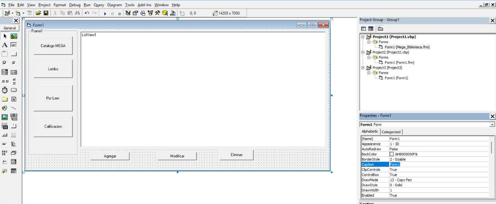
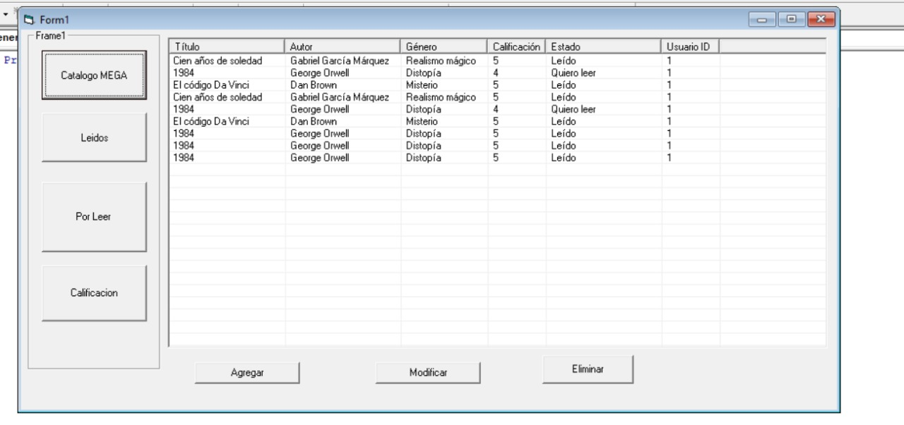
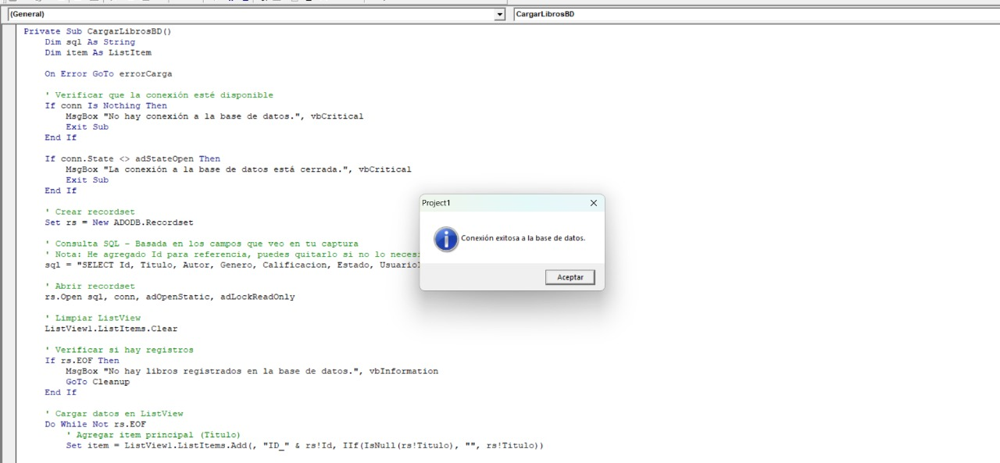
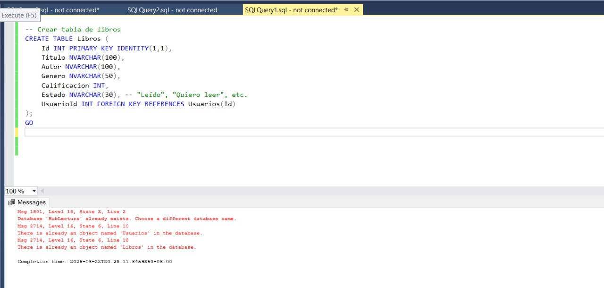
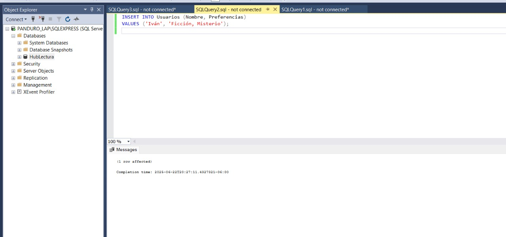

# HubLectura VB6 📚

Este es un proyecto en Visual Basic 6 que se conecta a una base de datos SQL Server llamada `HubLectura`.

## Capturas del Proyecto

A continuación se muestran capturas del sistema ejecutándose en mi equipo:
### Formulario Principal

### Libros Cargados

### Cargar Libros

### Conexión a la BD

## Base de datos:
Tablas:
- Libros
- 
- Usuarios
- 

## Requisitos:
- Visual Basic 6
- SQL Server Express

  ##  Descripción del desarrollo

- Se desarrolló un programa en Visual Basic 6 con conexión a SQL Server.
- Se implementó una interfaz con botones funcionales que cargan libros por estado.
- El usuario puede **agregar**, **modificar** y **eliminar** libros desde la pestaña “Calificación”.
- La base de datos tiene tablas `Libros` y `Usuarios`, normalizadas para gestionar múltiples registros.
- La carga de libros es dinámica y responde a los botones laterales (“Leídos”, “Por leer”).
##  Problemas conocidos

-  Cadena de conexión sensible a errores tipográficos (`\LAF` en vez de `\LAP` causó fallos).
- La base de datos requiere configuración manual en SQL Server.
-  No se implementaron pruebas automatizadas.
-  Requiere ejecutar como administrador en algunas configuraciones.
-  La interfaz es funcional pero no moderna ni adaptativa.

##  Retrospectiva

###  ¿Qué hice bien?
- Conecté correctamente Visual Basic 6 con SQL Server.
- Implementé botones que cargan y filtran libros según su estado.
- Usé buenas prácticas en la separación del código y lógica SQL.
- Subí el proyecto completo a GitHub con imágenes y documentación.

###  ¿Qué no salió bien?
- Tiempo perdido por error de conexión con el servidor SQL.
- Falta de validaciones en los formularios.
- No hubo planeación previa de estructura de carpetas.

###  ¿Qué puedo hacer diferente?
- Usar C# o WPF para una interfaz más moderna.
- Agregar validaciones de entrada en todos los campos.
- Implementar pruebas unitarias.
- Crear un script `.sql` para automatizar la creación de tablas.
- Añadir feedback visual y alertas al usuario en cada acción.

## Autor:
Iván Careaga Panduro
